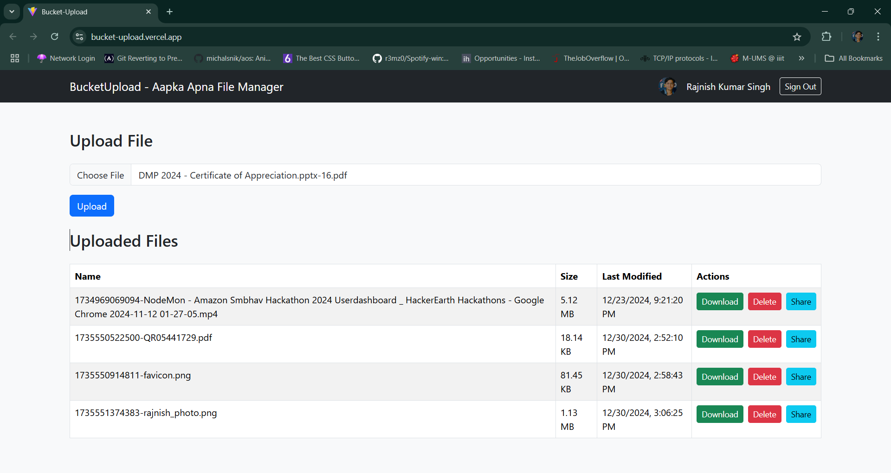

## BucketUpload - Apka Apna File Manager

## Website Link

https://bucket-upload.vercel.app/

## Functionalities

1. Every user will be able to Login and SignOut to the portal.
2. Every user will be able to view only their individual data and not of other users.
3. Upload your files (img,video,pdf,doc,txt,etc.) to the portal which will be stored in the AWS S3 bucket.
4. Delete your files from the portal if no longer needed in manager
5. Share your files to any gmail user if required or just share the link to the file by copying it.

## Tech Stack

`Vite + ReactJs`, `Google OAuth`, `AWS S3`, `EmailJS`

## Maintainer

`Rajnish Kumar Singh`

